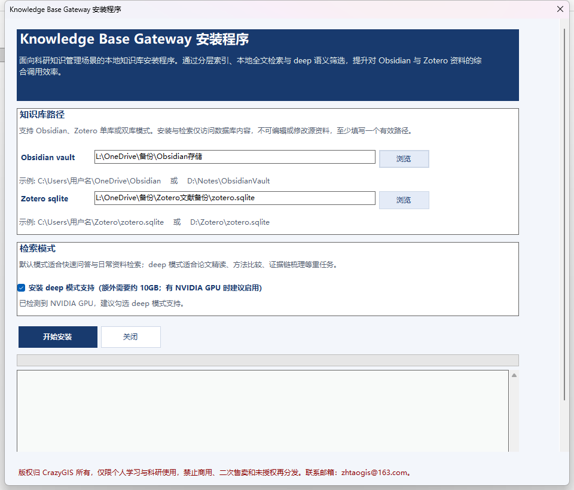
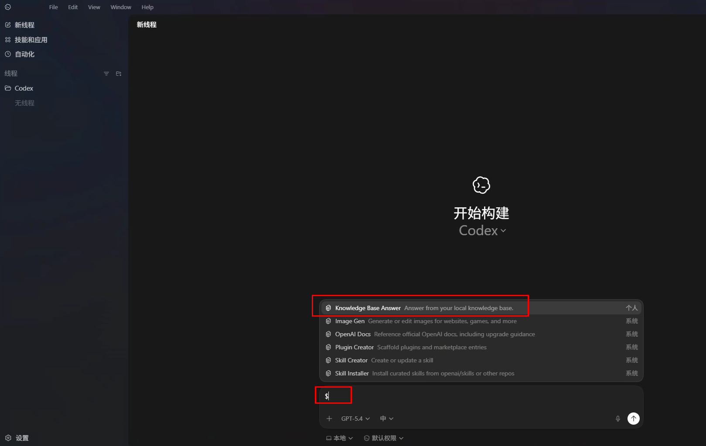
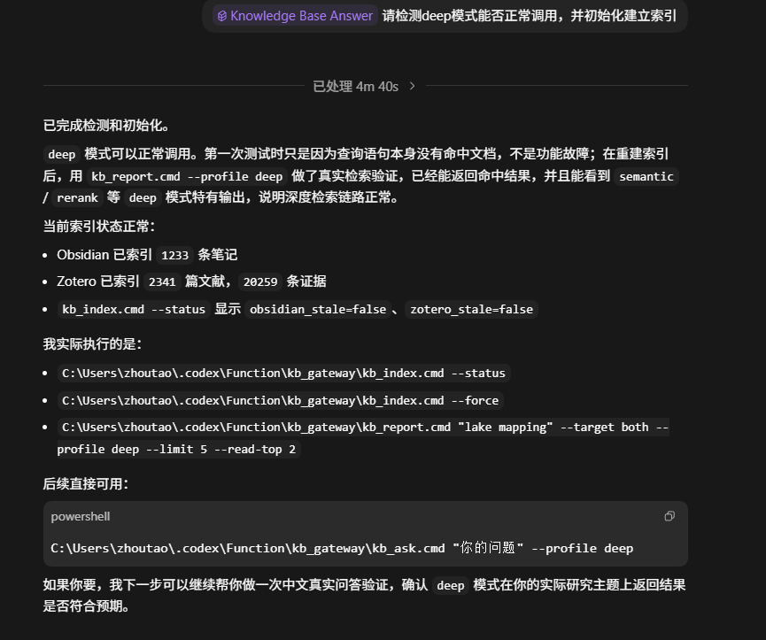
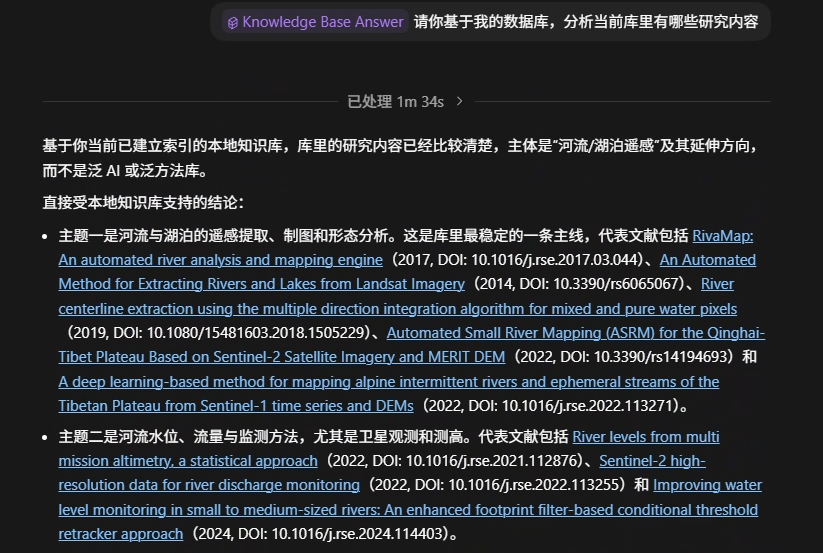
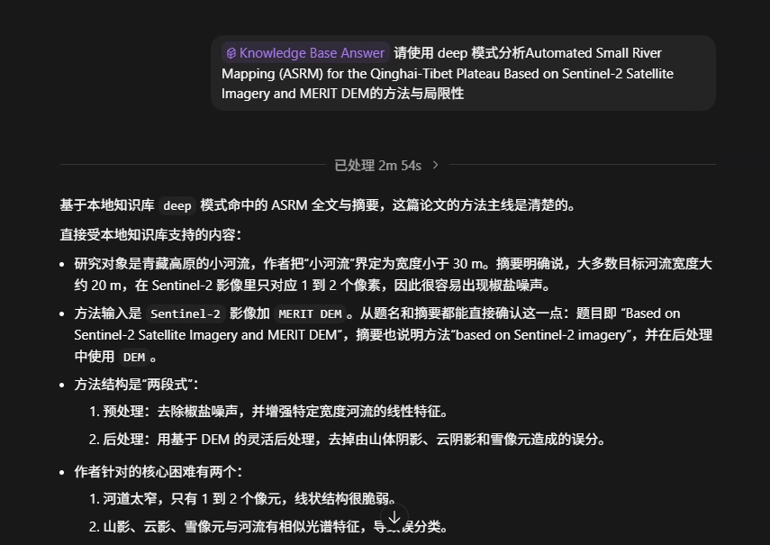

# Knowledge Base Gateway

## 版本更新

- 版本号：v1.1.2026.9903
- 发布日期：2026-04-10
- 当前版本简要：支持 Obsidian、Zotero、EndNote 三类本地知识源接入，提供 fast 与 deep 两种模式
- 发布说明：[docs/releases/v1.1.2026.9903.md](docs/releases/v1.1.2026.9903.md)
- 下载地址：[GitHub Releases](https://github.com/iawnfoanaowt/Knowledge-Base-Gateway/releases)
- 视频介绍：[【Codex 神器！把 Obsidian、Zotero、EndNote 统一集成为本地科研知识库】](https://www.bilibili.com/video/BV13CDtBsEcg/?share_source=copy_web&vd_source=31d7ef23294e8878d5a5a9aa3c5763ff)

## 安装说明

下面内容与仓库中的 [安装说明.md](安装说明.md) 保持一致。
# Knowledge Base Gateway 安装说明

> 更新说明：当前版本已支持 `EndNote` 作为正式只读数据源，可与 `Obsidian`、`Zotero` 任意组合使用。EndNote 现已支持附件全文检索与 `deep` 模式联动；安装时 EndNote 路径统一填写 `.enl` 文件。程序仅访问数据库内容，不会编辑、删除或修改 EndNote 源资料。

## 1. 这是什么

做科研的人，积累知识时真正麻烦的通常不是“找不到文献”，而是阅读的资料太多、太杂，临时要回答一个具体问题时，往往还得在 Zotero、Obsidian、EndNote、PDF、笔记、批注之间来回翻找，再手动串联证据。时间一长，文献越来越多，真正难的不是知道“有没有这篇”，而是快速想起来“它讲了什么、和当前问题有什么关系”。

`Knowledge Base Gateway` 是一套供 Codex 调用的本地研究检索引擎，由 `CrazyGIS` 开发。它的目标不是把所有资料一股脑塞给大模型，而是让 Codex 先在你的本地知识库中找到和问题最相关的证据，再基于这些证据做分析、整理和回答。

它真正解决的是下面这类问题：

- 本地资料已经积累很多，但每次要调用时，仍然要靠自己一点点翻。
- 相关内容分散在 Zotero 文献库、批注、笔记、EndNote 条目、附件全文，以及 Obsidian 的长期整理中，很难一次找全。
- 在线 AI 虽然能读 PDF，但能上传的数量有限，而且前期整理、筛选、上传也很耗时。
- 知识库是持续增长的，每周都在更新，人工重复整理的成本越来越高。

这套方案的价值在于：

- 不需要把大量本地资料上传到云端，再重新做一遍整理。
- 不需要先手动挑出 10 篇、20 篇、30 篇论文再交给 AI。
- 只要相关内容已经沉淀在你的本地知识库里，就能尽可能统一检索、集中调用。
- 更适合硕博生和长期研究者面对“大而杂、长期积累、持续更新”的个人知识库。

可以把它理解为：一套让 Codex 更适合科研场景的本地研究检索引擎。

版权归 `CrazyGIS` 所有，仅限个人学习与科研使用，禁止商用、二次售卖和未授权再分发。联系邮箱：`zhtaogis@163.com`。

## 2. 为什么现在需要它

这套方案并不是凭空出现的，它是沿着科研用户使用 AI 的真实演化一步步长出来的。

### 大模型出现之前

硕博生平时要积累大量文献。一方面要知道某个研究是否存在，另一方面还要记住它大致讲了什么、有什么方法和结论。结果往往是对少数内容有印象，但真正需要系统梳理某个问题时，还是得一篇篇重新翻，尤其涉及到要写文献综述、引言等场景。

### 在线 AI 刚发展起来时

后来可以把少量 PDF 上传给在线 AI，让它帮助阅读、整理和总结。这确实提高了效率，但很快就会碰到上下文上限。通常能稳定处理的文献数量并不多，资料一多，效果就明显受限。

### 更大规模的在线文献整理阶段

再后来，一些在线工具开始支持上传更多文献，例如可以一次处理几十篇、上百篇，甚至更大的文献包。这一步比早期方案前进了很多，但仍然有一个核心痛点没有解决：硕博生真正的个人知识库不是临时凑出来的若干 PDF，而是一个长期积累、持续更新、结构并不总是规整的本地数据库。为了喂给在线工具，用户仍然要先花时间把相关文献重新筛出来、整理好、分批上传。

### 本地 AI 代理出现之后

Codex、Claude Code 这类本地 AI 代理出现后，已经可以访问本地文件，这为“直接面向本地知识库工作”提供了基础。但如果没有一层专门面向科研知识库的本地检索能力，AI 仍然会被下面这些问题拖住：

- 本地知识库规模很大，单次对话上下文仍然有限。
- Zotero、EndNote 里不只有 PDF，还有批注、笔记、附件和长期累积的整理痕迹。
- Obsidian 中也不一定都是规整分类的笔记，很多内容带有明显的长期积累特征。
- 真正困难的不是“能不能读文件”，而是“能不能先从庞杂知识库里高质量地把证据找出来”。

`Knowledge Base Gateway` 的意义就在这里。它不是简单地“让 AI 去读本地文件”，而是先在本地完成全面读取、索引和高质量检索，再把真正有价值的证据交给 Codex。最终目的，是有效降低硕博生在文献积累、文献管理和文献分析上的门槛。

需要特别说明的是，这套方案并不追求“替你自动下载全部文献、自动替你读完所有内容”。它更强调研究者自己长期阅读、收藏、整理和理解文献，由系统负责把这些已经沉淀在本地知识库里的内容尽可能快速、准确地检索出来，再交给 Codex 做辅助分析。AI 可以帮助梳理线索、整理证据、给出粗略参考，但不能替代研究者自己对知识的理解、判断和思考，也不应被当作科研结论或正式写作内容的最终来源。

## 3. 使用前提

使用这套本地研究检索引擎前，需要满足下面几个前提：

- 你需要有可用的 `GPT Plus` 会员。
- 你需要已经在本地安装好 `Codex`。
- 日常场景下，`Codex` 的额度通常足以支撑这类本地知识检索，不需要把它理解成高频、大规模的云端文档托管服务。

## 4. 它适合谁

更适合下面这些用户：

- 文献量已经比较大，并且还在持续积累的硕博生和研究者。
- 长期使用 `Zotero`、`Obsidian` 或 `EndNote` 管理资料的人（任意一种或任意组合都可以）。
- 需要跨时间、跨主题回溯研究线索的人。
- 经常要围绕一个具体问题，从很多历史资料里快速找到相关证据的人。

不太适合下面这些情况：

- 只是偶尔临时读几篇论文的人。
- 还没有形成自己的本地知识库积累的人。
- 只希望 AI 读当前一两篇材料，而不需要调动长期积累的人。

## 5. 它能处理什么

从用户视角看，这套引擎面向的是你平时真正会看的知识内容，包括：

- Zotero 里的文献条目、文献信息、阅读笔记、批注，以及附件中能够读取到的文本内容。
- EndNote 里的文献条目、题录信息、摘要、关键词、笔记、附件路径，以及可直接提取文本的 PDF 内容。
- Obsidian 里的研究笔记、专题整理、阶段性总结和长期沉淀下来的知识记录。
- 这些内容之间跨时间、跨来源的关联线索。

你不需要把知识库先整理成一套“绝对规整”的样子再使用。对于科研场景下实际会反复调用的主要知识内容，这套方案会尽可能做全面覆盖和统一检索。

如果从技术层面理解，它稳定处理的是本地知识库中最关键的文本证据层，包括：

- Obsidian 的 Markdown 笔记内容。
- Zotero 的文献主条目、题录与摘要信息。
- Zotero 的笔记与批注内容。
- Zotero 已经生成出来、可供读取的全文文本。
- EndNote 的文献主条目、摘要、关键词与附件路径。
- EndNote 附件中可直接提取文本的 PDF 全文切块。

需要说明的是，这里强调的是“尽可能全面覆盖科研场景中实际要调用的知识内容”，而不是承诺对任意附件、任意格式、任意二进制文件都做完全一致的万能解析。对绝大多数科研用户来说，你平时真正会反复调用的知识内容，已经在这套覆盖范围里。

## 6. 默认模式与 deep 模式

这套引擎有两类工作方式，可以简单理解为“快查”和“深读”。

### 默认模式

默认模式主要对应：

- `fast`
- `balanced`

适合下面这些任务：

- 快速确认有没有相关研究。
- 快速查一个结论、方法或关键词。
- 快速围绕某个主题做初步总结。
- 高频、日常型的知识调用。

特点是：

- 更快。
- 更适合日常使用。
- 通常不需要额外的深度模型参与。

### deep 模式

`deep` 模式更适合下面这些任务：

- 精读某篇论文。
- 比较多篇论文的方法异同。
- 查看实验细节、局限性和证据链。
- 当默认模式找到的证据还不够，需要继续深挖时。

特点是：

- 更慢，但更适合重分析任务。
- 需要额外安装深度依赖和模型。
- 如果电脑有可用的 `NVIDIA GPU`，会优先利用 GPU。
- 如果安装时不启用 `deep`，不会影响默认模式、索引建立和日常检索；只是无法使用更重的深度阅读与语义精排能力。

简单理解：

- 默认模式：适合快查。
- `deep` 模式：适合深读。

### `deep` 的自动调用

在和 Codex 直接对话时，通常不需要手动去记命令。系统会根据你的问题类型，优先判断是走默认模式还是进入 `deep`。

下面这些场景，更容易自动进入 `deep`：

- 明确要求“详细分析”“深入分析”“精读”。
- 明确要求比较多篇论文的方法、实验设计、优缺点或局限性。
- 要求围绕某篇或某几篇论文做更细的证据梳理。
- 要求基于全文内容回答，而不是只做快速概括。
- 默认模式找到的证据还不够，需要继续深挖。

下面这些场景，通常仍会优先走默认模式：

- 只是快速确认有没有相关研究。
- 只是快速问一个结论、定义或关键词。
- 只是做一个主题的初步整理或快速总结。
- 只是做高频、日常型的知识调用。

也就是说，普通问答默认优先轻量模式，只有在明确需要更深、更慢、更重分析时，才更可能自动切到 `deep`。

### 如何手动调用 `deep`

如果你希望直接指定 `deep`，可以在自然语言中明确说出来，例如：

- `请用 deep 模式分析这个问题`
- `请开启 deep 模式，对这几篇论文做方法比较`
- `请使用 deep 模式，基于全文证据回答`
- `不要快查，请直接用 deep 模式深挖`

如果你只想快速查一下，也可以反过来明确表达，例如：

- `先快速检索，不用 deep`
- `先给我一个快查版结论`

这样做的好处是，能够让 Codex 更快判断你是要“快查”，还是要“深读”。

## 7. 安装前需要准备什么

安装时，至少要提供下面三种路径中的一种：

- `Obsidian` 库路径
- `Zotero` 数据库路径
- `EndNote` `.enl` 文库路径

三者可以只填一个，也可以任意组合填写。

如果安装时只填写了一条知识库路径，后续使用一段时间后又想补充其他知识库路径，建议先卸载当前版本，再重新安装，并在安装时重新填写完整的知识库路径组合。

### Obsidian 路径应该填什么

这里填写的是 Obsidian 的库文件夹。

示例：

- `C:\Users\用户名\OneDrive\Obsidian`
- `D:\Notes\ObsidianVault`

### Zotero 路径应该填什么

这里填写的是 `zotero.sqlite` 文件本身，不是 Zotero 文件夹。

示例：

- `C:\Users\用户名\Zotero\zotero.sqlite`
- `D:\Zotero\zotero.sqlite`

### EndNote 路径应该填什么

这里填写的是 `EndNote` 的 `.enl` 文库文件本身，不再使用目录写法。

示例：

- `M:\EndNote\My EndNote Library.enl`

## 8. 安装后会放到哪里

安装程序只会把文件放到当前用户的 `.codex` 目录下：

- `C:\Users\你的用户名\.codex\Function\kb_gateway`
- `C:\Users\你的用户名\.codex\skills\kb-answer`

如果 `.codex\Function` 不存在，安装程序会自动创建。

## 9. 安装程序不会做什么

安装程序默认不会做下面这些事：

- 不写 Windows 注册表。
- 不创建桌面快捷方式。
- 不创建开始菜单快捷方式。
- 不修改系统环境变量。
- 不安装系统级 Python。
- 不编辑或修改 Obsidian 源资料。
- 不编辑或修改 Zotero 数据库或 storage。
- 不编辑、删除或修改 EndNote 的 `.enl`、`.Data`、`.eni` 与附件目录。

也就是说，安装器只管理它自己的运行目录，不会主动去动你的本地知识库源文件。
同时，安装版不会再把可直接编辑的核心源码原样放进安装目录，以降低普通用户直接修改 EndNote 门禁逻辑的难度。

## 10. 首次使用与索引说明

这套引擎首次使用时，会先建立本地索引。

这一步通常会比普通问答稍慢一些，因为需要先把 Obsidian 和 Zotero 中的内容整理成可检索的结构。后续日常使用时，一般会直接基于已有索引检索，因此速度会明显更快。

如果出现下面这些情况：

- Zotero 或 Obsidian 内容变化较大。
- 很久没有使用这个能力。
- 例如超过约 `7` 天没有更新索引。

系统会判断索引已经过老，并提示需要刷新或重建索引。

索引重建不需要手动敲复杂命令，可以直接通过自然对话让 Codex 执行，例如：

- “请先刷新索引”
- “请重建知识库索引再回答”
- “先更新 Obsidian 和 Zotero 的索引”

建议在首次安装完成后，先在 Codex 对话中执行这句自然语言命令：

- `请检测 deep 模式能否正常调用，并初始化建立索引`

这样做的作用是：

- 检查 `deep` 模式依赖与模型是否可正常调用。
- 完成本地知识库的初次索引构建。
- 尽早发现当前机器上的环境问题。

如果 `deep` 模式没有正常调用，Codex 可以继续根据报错信息自动排查并修复相关问题。

这条命令也会统一检查：

- 当前本地程序版本号
- 是否与 GitHub 最新公开版本一致
- Obsidian、Zotero、EndNote 当前是否还能被正常读取和适配

如果检测到以下情况：

- 本地版本低于 GitHub 最新版本
- 数据库结构因软件大版本升级发生变化，导致当前程序可能无法完全适配

系统会给出“建议更新”的提醒，但不会阻止当前继续回答和使用。

## 11. 对话安全提醒

这套方案在设计上对 Obsidian、Zotero 和 EndNote 源数据保持只读，底层严禁主动修改、编辑本地知识库。

但在实际使用中，仍然建议注意下面这些对话习惯：

- 为了让 Codex 能顺利连续调用多个本地脚本、索引程序和运行环境，建议在相关对话中开启完全访问权限；否则在执行过程中可能会反复弹出授权确认，影响使用流畅度。
- 这里的完全访问权限，是为了让 Codex 顺利执行本功能自身的代码与本地环境，不代表本功能会修改数据库。
- 如果当前对话开启了完全访问权限，不要在知识库相关场景里随意使用“删除”“清空”“批量移动”等高风险措辞。
- 即使你的本意只是想表达“不要这些内容”或“把这些去掉”，也尽量避免让 AI 误解成文件级操作指令。
- 本方案生成的缓存、索引和运行文件会由工具自行管理，通常不需要你手动清理。

简单说：知识库本身按设计是只读的，但在 AI 具备多模态能力和完全访问权限时，用户仍应避免给出容易引发误操作的自然语言指令。

## 12. 如何卸载

推荐直接使用安装目录中的卸载程序：

- `C:\Users\你的用户名\.codex\Function\kb_gateway\KnowledgeBaseGatewayUninstall.exe`

建议按下面顺序操作：

1. 先关闭 Codex，以及可能仍在运行的 Knowledge Base Gateway 相关窗口或服务。
2. 进入 `kb_gateway` 安装目录。
3. 双击运行 `KnowledgeBaseGatewayUninstall.exe`。
4. 按界面提示完成卸载。

卸载时只会删除：

- `C:\Users\你的用户名\.codex\Function\kb_gateway`
- `C:\Users\你的用户名\.codex\skills\kb-answer`

不会删除：

- Obsidian 笔记库。
- Zotero 文献库。
- EndNote 文库与附件目录。
- 其他 Codex 技能。
- 其他系统文件。

## 13. 如何更新

推荐的更新方式很简单：

1. 先卸载当前版本。
2. 再从 GitHub 下载最新版安装包。
3. 重新安装并按需要重新检查索引与授权状态。

这种方式最稳，能够避免旧版本残留文件和新版本配置逻辑混用。

## 14. 如果安装程序被 Windows 阻止

如果出现“智能应用控制已阻止可能不安全的应用”之类提示，通常不是安装脚本本身报错，而是 Windows 对未签名、未建立信誉的 `EXE` 做了拦截。

当前这套安装器属于本地自定义打包程序，在没有代码签名证书前，部分 Windows 环境可能会直接拦截 `EXE`。

可通过 `Windows 安全中心` 临时调整智能应用控制设置：

1. 打开 `设置`
2. 进入 `隐私和安全性`
3. 打开 `Windows 安全中心`
4. 进入 `应用和浏览器控制`
5. 在“智能应用控制”中，将运行模式改为 `评估模式` 或 `关闭`（临时禁用）

若后续需要恢复安全限制，可在安装完成后再切换回原有状态。

## 15. EndNote 授权说明
`Obsidian` 和 `Zotero` 默认即可使用；`EndNote` 属于授权控制数据源。

这意味着：

- 这里授权的是 `Knowledge Base Gateway` 的 EndNote 数据访问功能，不是 EndNote 软件本身。
- 即使已经配置了 `EndNote` 的 `.enl` 路径，只要本机没有有效授权 JSON，程序也不会访问 EndNote。
- 没有授权、授权过期、机器码不匹配、签名无效、时间回拨异常等情况，都会导致 EndNote 被禁用。
- EndNote 被禁用时，不影响 `Obsidian` 和 `Zotero` 的继续使用。

### 安装时如何授权
安装器界面会提供单独的 EndNote 授权区域，包含：

- 当前机器码显示
- 复制机器码
- 导入授权 JSON

如果安装时没有导入有效授权：

- 安装仍然可以完成
- 但 EndNote 会被标记为已禁用
- 后续导入授权后即可恢复可用

### 安装后如何补授权
安装目录和便携包中都附带独立授权工具：

- `KnowledgeBaseGatewayAuthorization.exe`

它可以用于：

- 查看当前机器码
- 导入授权 JSON
- 查看当前授权状态

如需申请授权，请联系：

- `zhtaogis@163.com`

当前可免费获得 `10` 天的 EndNote 数据访问功能授权。

### 运行时会如何提示
当程序检测到 EndNote 未授权时：

- `kb_ask`
- `kb_search`
- `kb_report`
- `kb_index --status`
- `kb_doctor`

这些入口都会给出明确提示，说明 EndNote 已被授权门禁禁用，并建议导入授权 JSON；但不会阻断其他数据库的检索与回答。

## 截图预览

### 安装器界面

### 在 Codex 中启用技能

### deep 检测与索引初始化示例

### 普通模式检索示例

### deep 模式分析示例

